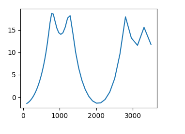
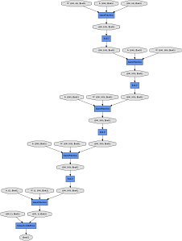
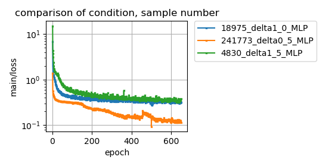

# ディープラーニングフレームワークのchainerによるピーク位置の推定    
  

## 内容   
  
凸型のピークをもつ１Ｄデータの左端の第１ピークの位置(index)を推定する。  
下図に１Ｄデータの例を示す。  
  
  
## 学習モデル  

入力64次元。5層のFCで中間層のユニット数は100。出力1次元。  
学習する未知パラメーターの数は36901個ある。  
  
モデルを可視化したグラフがdocsホルダーの中にあります。(docs/cg_MLP.png)  

## 学習サンプル数と損失の関係  
  
学習サンプル数を、4830個(-d 1.5), 18975個(-d 1.0), 241773個(-d 0.5)と変化させたときの損失(main/loss)の様子を下図に示す。  
  

学習サンプル数が少ないと(4830,18975)、損失はより大きな値で止まり下がりきらない。 
学習サンプル数は学習する未知パラメーター数よりも十分大きいものが必要のようだ。  
  

## プログラムとオプション  
  
- make_dataset.py　データセットを作成する  
- train.py  chainerで学習する  
- log_plot.py chainerのlog出力の中の損失をまとめてプロットする  

### オプション  
  
- -d 　分割する幅を示す。値が小さいほど、細かく分割して、サンプル数が増す。　　

### 動作例

python make_dataset.py -d 1.0　train用のデータセットの作成  
python make_dataset.py -d 1.5  test用のデータセットの作成  
python train.py -d 1.0 -e 1000  1000エポック回、学習する  
python log_plot.py　損失のプロット（任意）

## 結果  
  
学習サンプルを使っての判定でも正解率85～95%とよくない。  
  
## ライセンス  
  
train.pyとplot_report_logscale.pyはchainerのレポジトリにあるものを変更したものです。chainerのライセンスについては、LICENSE-chainer.txtを見てください。  
上記以外は、MITライセンスに従います。  

